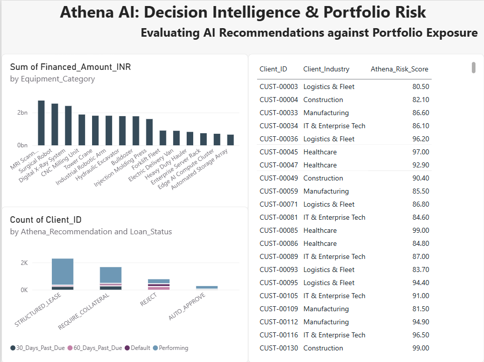

# Athena AI: Decision Intelligence & Portfolio Risk 📊

## 📌 Project Overview
This project is an end-to-end data analytics and engineering pipeline designed to evaluate the accuracy and financial impact of an AI credit-decisioning model ("Athena"). 

The business goal is to analyze whether the AI's automated loan recommendations (Auto-Approve, Structured Lease, Require Collateral, Reject) align with actual real-world loan performance (Performing vs. Defaulting) across a heavy equipment finance portfolio.

## 🛠️ Tech Stack & Skills Demonstrated
* **Python (Pandas & NumPy):** Synthetic data generation, ETL pipelines, data cleaning, and dataset merging.
* **SQL:** Relational database design (Star Schema), DDL constraints, and complex business queries.
* **Power BI:** Data modeling, cross-filtering, UI/UX layout design, and executive dashboarding.
* **Domain Knowledge:** Decision Intelligence, Risk Assessment, and Equipment Financing.

## 📁 Repository Structure

### 1. Data Engineering & ETL (Python)
* `01_athena_data_generation.py`: A Python script utilizing NumPy and Pandas to generate 5,000 realistic records of equipment finance contracts, including risk scores and delinquency statuses.
* `02_athena_etl_pipeline.py`: The core ETL script that extracts the raw CSV, normalizes the data into dimensional tables (`dim_clients`, `dim_equipment`), and cleans date formats to prepare for SQL insertion.

### 2. Database Architecture (SQL)
* `03_database_setup.sql`: Contains the DDL statements to build a relational Star Schema, defining Primary Keys and Foreign Keys connecting the fact and dimension tables.
* `04_business_queries.sql`: Analytical queries designed to extract key business metrics, including high-risk client identification and total financial exposure by equipment category.
* `05_data_validation_checks.sql`: Quality assurance queries to verify data integrity and table constraints post-load.

### 3. Business Intelligence (Power BI)
* `Athena_Decision_Intelligence_Dashboard.png`: The final executive dashboard featuring:
  * A custom risk-filtering matrix identifying critical clients (Risk Score > 80).
  * Portfolio exposure column charts grouped by equipment category.
  * A stacked column chart validating Athena AI's logic by comparing recommended actions against actual loan delinquency status.

## 💡 Key Business Insight
The dashboard reveals a critical insight regarding the AI's threshold limits: a significant portion of the loans Athena categorized as "REJECT" are actually performing flawlessly. By adjusting the AI's conservative parameters, the business can capture profitable market share without exposing the portfolio to unnecessary risk.
